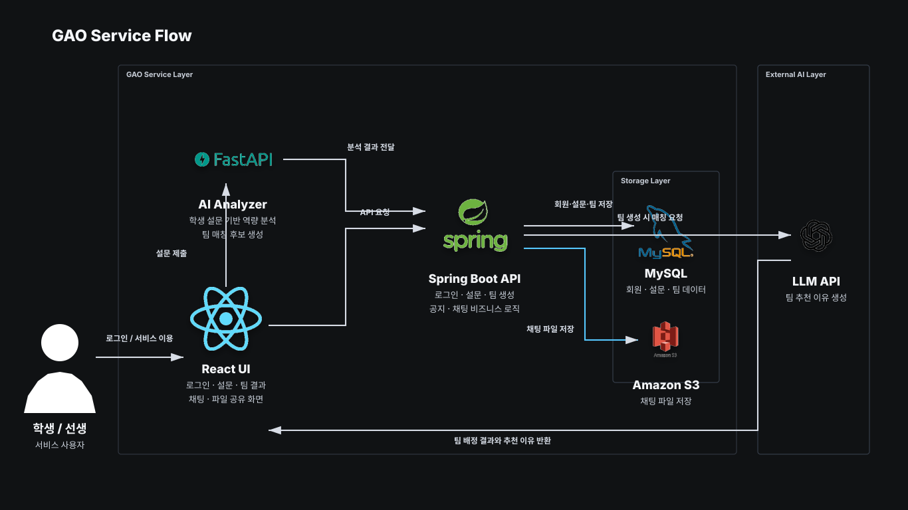

# GAO 서비스 흐름도

## 포함한 요소

- 사용자: 학생, 선생/관리자
- Frontend: React, JavaScript, CSS Module, Axios, Zustand, React Router
- Backend: Spring Boot, Spring Security, JPA, WebSocket, STOMP
- Database: MySQL
- AI Server: FastAPI, Python, LangChain, LangGraph
- Storage: AWS S3, Presigned URL
- Storage: AWS S3, Presigned URL

## 핵심 흐름

로그인 → 설문 → 팀 생성 → AI 매칭 → 팀 결과 → 채팅/파일 공유
